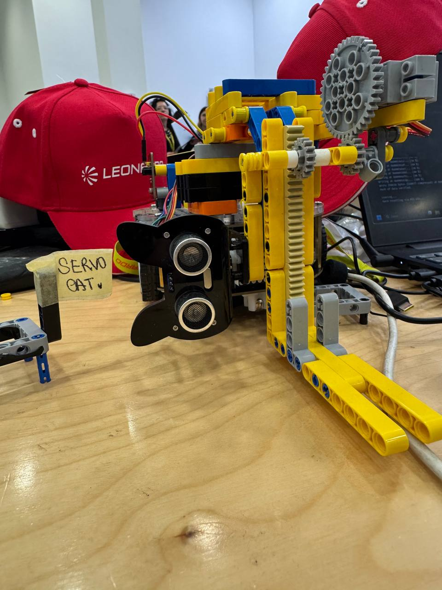

# 🏆 Leonardo x Talent Garden Hackathon - April 2025 
**1st Place | Project Servo-Cat**

Welcome to the repository of the project developed at the hackathon organized by **Leonardo** in collaboration with **Talent Garden**, held on April 5-6, 2025.

In this repository you will find the source code related to the two challenges faced during the competition, both based on the design and control of an autonomous robot using a microcontroller.

---

## ⚙️ Overall goal

Design, assemble, and program a robot equipped with **sensors** and **actuators**, capable of autonomously tackling two separate tests:

1. **Autonomous navigation in an obstacle maze**
2. **Manipulation and vertical lifting of objects**

All in a time-constrained context, with constrained technical resources and under competitive stress.

---

## 🧭 Challenge 1 - Autonomous Navigation

The robot, dubbed **Servo-Cat**, had to traverse a **static maze** while avoiding obstacles. The special feature of the test was that the **position of the obstacles was not known until the time of the race**, requiring a dynamic and adaptive navigation strategy.

### 🔑 Technical objectives:
- Real-time readout from **distance sensors** 
- **avoidance and navigation** algorithm for unknown paths
- Management of **autonomous **movement** by DC motors
- Modularity and responsiveness of embedded software

---

## 🏗️ Challenge 2 - Object Handling

The second challenge involved the design of a **vertical lifting system**, inspired by the logic of a forklift. We implemented a structure equipped with a **toothed wheel and rack mechanism**, controlled by a servomotor and driven via microcontroller.

### 🔑 Technical objectives:
- Mechanical design of the lifting system
- Precise control via **motor and position sensors**
- Management of object stability during lifting
- Embedded control of vertical motion

---

## 🤝 Team & Collaboration

This project was made possible by intensive teamwork, based on **complicity, collaborative spirit** and continuous problem solving. Each member actively contributed to the design, software development, and hardware implementation.

---

## 📸 Media

📌
